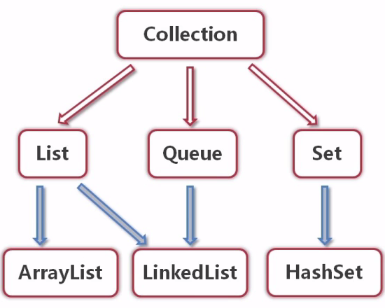

# 接口
1. 接口的方法都是抽象的，接口不能有方法体
2. 子类必须重写接口的方法，除非是抽象类
3. 类是被子类继承，接口是被子类实现

# 包package
##包的作用
1、把功能相似或相关的类或接口组织在同一个包中，方便类的查找和使用。
2、如同文件夹一样，包也采用了树形目录的存储方式。同一个包中的类名字是不同的，不同的包中的类的名字是可以相同的，当同时调用两个不同包中相同类名的类时，应该加上包名加以区别。因此，包可以避免名字冲突。
3、包也限定了访问权限，拥有包访问权限的类才能访问某个包中的类。
##import 引入某个包，可以随意使用包内的其它类

# java数据结构

1. 集合，不同数组，有映射关系方便查找，内存大小动态增加
 collection： 容器
 	
 	1.List -> Arrays:ArrayList -> 迭代器 Iterater
 		泛型：List<Course>,
 			1.可以填入泛型类型，以及泛型类型的子类型
 			2. 泛型不可使用基本类型，必须使用引用类型
 			List（集合）可以放任何类型的对象引用进去。取出来的时候就需要类型强转。
			List集合可以规定泛型，就是放进去的时候判断是否个可以把该类型的数据放进去，不行的话就报错。然后取出来的时候就不用强转了
	2 Set